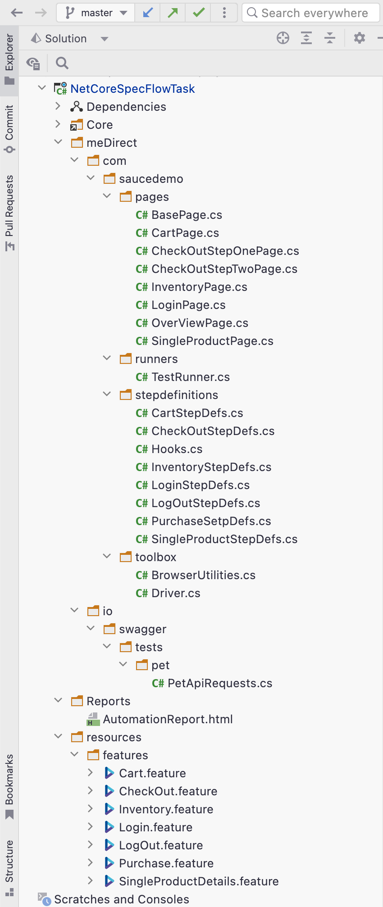

# NetCore SpecFlow Selenium RestSharp Automation Test Project
 Testing Framework for the SauceDemo website using Selenium, NUnit and Specflow

## Deliverables
 - Detailed user stories at the top of each Feature file 
 - Test frame work using page-object model framework
 - Test frame work using NUnit
 - Test frame work using SpecFlow
 - Test frame work using Selenium
 - Test frame work using RestSharp
 - All tests accompanied by Gherkin statements

## Requirements
 - Selenium WebDriver
 - NUnit
 - SpecFlow
 - RestSharp
 - Page-Object Model Framework

## Setup 
 - Download Github repository
 - Open the solution in Visual Studio
 - Open the Test Explorer
 - Run all tests.

NuGet Packeges used:
 - Nunit
 - NUnit3TestAdapter
 - Gherkin
 - SeleniumWebDriver
 - SeleniumWebDriver.ChromeDriver
 - SpecFlow
 - SpecFlow.NUnit

## Project Package And File Structure
   

* **meDirect** ↣ **com** ↣ **saucedemo** ↣ **pages**
  * Page Object Model for related pages
 
 
* **meDirect** ↣ **com** ↣ **saucedemo** ↣ **stepdefinitions**
  * Contains step definitions for the tests

* **meDirect** ↣ **com** ↣ **saucedemo** ↣ **toolbox**
  * Class files to support the project.

   
* **meDirect** ↣ **io** ↣ **swagger** ↣ **tests** ↣ **pet**
   * RestSharp API Test Files

* **Reports** 
    * [ExtentReports related Test Reports]()

* **resources** ↣ **features** 
   * Contains scripts written in Gherkin in feature/execution file.

## UI Test Cases

The tests which were carried out are as follows:

 - [User Story 1: Login](https://github.com/esalkan/AutomationNetCoreSpecFlowSelenium/projects/1#card-82218922)
   - [Test Case 1.1](https://github.com/esalkan/AutomationNetCoreSpecFlowSelenium/projects/1#card-82219475)
   - [Test Case 1.2](https://github.com/esalkan/AutomationNetCoreSpecFlowSelenium/projects/1#card-82219703)
 - [User Story 2: LogOut](https://github.com/esalkan/AutomationNetCoreSpecFlowSelenium/projects/1#card-82220001)
   - [Test Case 2.1](https://github.com/esalkan/AutomationNetCoreSpecFlowSelenium/projects/1#card-82220114)
   - [Test Case 2.2](https://github.com/esalkan/AutomationNetCoreSpecFlowSelenium/projects/1#card-82220262)
 - [User Story 3: Inventories](https://github.com/esalkan/AutomationNetCoreSpecFlowSelenium/projects/1#card-82294610)
   - [Test Case 3.1.](https://github.com/esalkan/AutomationNetCoreSpecFlowSelenium/projects/1#card-82294863)
 - [User Story 4: SingleProductDetails](https://github.com/esalkan/AutomationNetCoreSpecFlowSelenium/projects/1#card-82294971)
   - [Test Case 4.1](https://github.com/esalkan/AutomationNetCoreSpecFlowSelenium/projects/1#card-82295153)
 - [User Story 5: Cart](https://github.com/esalkan/AutomationNetCoreSpecFlowSelenium/projects/1#card-82295355)
   - [Test Case 5.1](https://github.com/esalkan/AutomationNetCoreSpecFlowSelenium/projects/1#card-82295421)
   - [Test Case 5.2](https://github.com/esalkan/AutomationNetCoreSpecFlowSelenium/projects/1#card-82295478)
 - [User Story 6: Checkout Feature](https://github.com/esalkan/AutomationNetCoreSpecFlowSelenium/projects/1#card-82295583)
   - [Test Case 6.1](https://github.com/esalkan/AutomationNetCoreSpecFlowSelenium/projects/1#card-82295673)
   - [Test Case 6.2](https://github.com/esalkan/AutomationNetCoreSpecFlowSelenium/projects/1#card-82295860)
   - [Test Case 6.3](https://github.com/esalkan/AutomationNetCoreSpecFlowSelenium/projects/1#card-82295982)
 - [User Story 7: Purchase](https://github.com/esalkan/AutomationNetCoreSpecFlowSelenium/projects/1#card-82296080)
   - [Test Case 7.1](https://github.com/esalkan/AutomationNetCoreSpecFlowSelenium/projects/1#card-82296228)

## Retrospective
Creating frameworks to test websites is a lot of fun. I imagine it will be easier when collaborating with a business analyst and a web developer.

It is the first Test framework I have written using C#, SpecFlow, and RestSharp, which I have never used until the last week. There may be many omissions, errors, and inaccuracies. Cases and scenarios can be derived and applied more.

